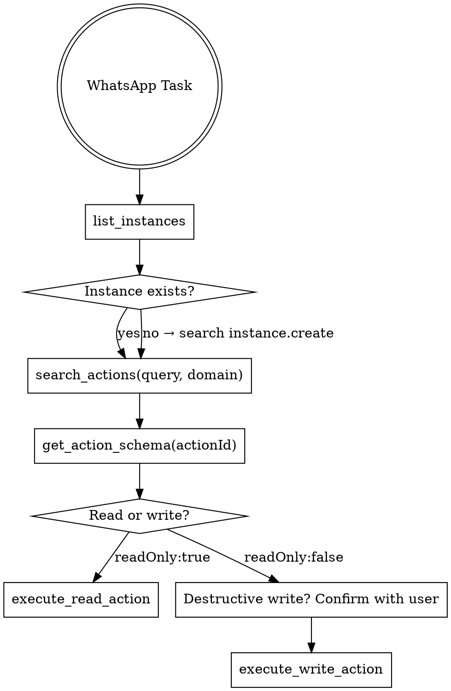

# Evolution API — Workflow

## Overview

The `evolution-api` MCP exposes **5 tools** over a catalog of **158 actions** (WhatsApp endpoints).
You NEVER call an endpoint by memory — you **discover** the `actionId` and its params via search tools, then execute.

**Core principle:** discover before executing. Never invent `actionId` or params — confirm with `get_action_schema`.

## The 5 Tools

| Tool | When to use |
|------|-------------|
| `list_instances` | ALWAYS first. Lists WhatsApp instances and connection state. Almost every action needs an `instance`. |
| `search_actions` | Discover the `actionId` by intent in natural language. Accepts `query`, optional `domain`, `limit`. |
| `get_action_schema` | See all params (type, required, description) of an `actionId` before executing. |
| `execute_read_action` | Execute a **read** action (`readOnly: true`). |
| `execute_write_action` | Execute a **write/mutation** action (`readOnly: false`) — send message, create/delete instance, configure webhook. |

## The Flow (follow in order)

### Steps

1. **`list_instances`** — discover which instances exist and their state (`open` = connected, `connecting`, `close`). Every action needs the instance name in the `instance` param.
2. **`search_actions`** — pass the intent in natural language. Restrict with `domain` when known (faster and less noise). Valid domains: `instance`, `message`, `chat`, `group`, `call`, `settings`, `label`, `proxy`, `event`, `chatbot`.
3. **`get_action_schema`** — with the candidate `actionId`, confirm the **required** params and their types. Do not skip this step for write actions.
4. **Execute** — choose the right tool by the action's `readOnly`:
   - `readOnly: true` → `execute_read_action`
   - `readOnly: false` → `execute_write_action`
   - Calling the wrong tool returns an error pointing to the correct one — do not force it.

## Hard Rules

- **NEVER guess an `actionId`.** Always get it from `search_actions`. If the search returns nothing, refine the query (try in both English and Portuguese, e.g. "send text" then "enviar texto").
- **Read/write split is mandatory.** Read → `execute_read_action`. Write → `execute_write_action`. Don't attempt reads on the write tool or vice versa.
- **Confirmation for destructive actions.** Before `instance.delete`, `instance.logout`, `chat.deleteMessageForEveryone`, `group.leaveGroup`, `*.delete`, or any bulk send: confirm the target and content with the user. Sending a WhatsApp message is an irreversible external action.
- **The `instance` param is almost always required** in every action (except `list_instances` and `instance.create`/`fetchInstances`). Get the name from `list_instances`, not from what the user "thinks" it is.
- **Phone numbers** must include country code, digits only: `5511999999999`. No `+`, no spaces, no dashes.

## Skills by Domain

For specific tasks, also load:

- `evolution-instances` — create/connect (QR code)/restart/delete instances and read state.
- `evolution-messaging` — send text, media, audio, poll, list, buttons, reaction, location, contact.
- `evolution-chat-groups` — chats, contacts, profile, privacy, and group operations.
- `evolution-events-webhooks` — webhook, websocket, and queues (rabbitmq, nats, sqs, kafka, pusher).
- `evolution-chatbots` — AI integrations: openai, dify, flowise, n8n, typebot, evolutionBot, evoai, chatwoot.

## Common Errors

| Symptom | Cause | Fix |
|---------|-------|-----|
| "Action 'X' not found in catalog" | Invented/wrong actionId | Use `search_actions` to get the real id. |
| "This action is a write. Use execute_write_action." | Wrong tool | Switch to `execute_write_action`. |
| 404/instance error | Wrong instance name | Run `list_instances` and use the exact name. |
| Message not delivered | Instance in `close`/`connecting` | Connect the instance (see `evolution-instances`). |
