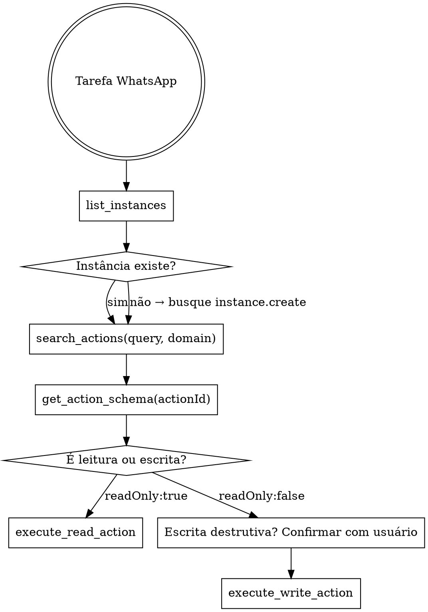

# Evolution API — Fluxo de Trabalho

## Visão geral

O MCP `evolution-api` expõe **5 tools** sobre um catálogo de **158 actions** (endpoints WhatsApp).
Você NUNCA chama um endpoint pelo nome de memória — você **descobre** o `actionId` e seus params via tools de busca, depois executa.

**Princípio central:** descubra antes de executar. Nunca invente `actionId` ou params — confirme com `get_action_schema`.

## As 5 tools

| Tool | Quando usar |
|------|-------------|
| `list_instances` | SEMPRE primeiro. Lista instâncias WhatsApp e estado de conexão. Quase toda action precisa de um `instance`. |
| `search_actions` | Descobrir o `actionId` por intenção em linguagem natural. Aceita `query`, `domain` opcional, `limit`. |
| `get_action_schema` | Ver todos os params (tipo, obrigatoriedade, descrição) de um `actionId` antes de executar. |
| `execute_read_action` | Executar action de **leitura** (`readOnly: true`). |
| `execute_write_action` | Executar action de **escrita/mutação** (`readOnly: false`) — enviar msg, criar/deletar instância, configurar webhook. |

## O fluxo (siga em ordem)

### Passos

1. **`list_instances`** — descubra quais instâncias existem e seu estado (`open` = conectada, `connecting`, `close`). Toda action precisa do nome da instância no param `instance`.
2. **`search_actions`** — passe a intenção em linguagem natural. Restrinja com `domain` quando souber (acelera e reduz ruído). Domínios válidos: `instance`, `message`, `chat`, `group`, `call`, `settings`, `label`, `proxy`, `event`, `chatbot`.
3. **`get_action_schema`** — com o `actionId` candidato, confirme os params **obrigatórios** e seus tipos. Não pule este passo para actions de escrita.
4. **Executar** — escolha a tool certa pelo `readOnly` da action:
   - `readOnly: true` → `execute_read_action`
   - `readOnly: false` → `execute_write_action`
   - Chamar na tool errada retorna erro orientando a tool correta — não force.

## Regras rígidas

- **NUNCA chute um `actionId`.** Sempre venha de `search_actions`. Se a busca não trouxer, refine a query (termos PT e EN, ex.: "enviar texto" e depois "send text").
- **Read/write split é obrigatório.** Leitura → `execute_read_action`. Escrita → `execute_write_action`. Não tente leitura na write nem vice-versa.
- **Confirmação para destrutivo.** Antes de `instance.delete`, `instance.logout`, `chat.deleteMessageForEveryone`, `group.leaveGroup`, `*.delete` ou qualquer envio em massa: confirme alvo e conteúdo com o usuário. Enviar mensagem WhatsApp é uma ação externa irreversível.
- **Param `instance` sempre presente** em quase toda action (exceto `list_instances` e `instance.create`/`fetchInstances`). Pegue o nome de `list_instances`, não do que o usuário "acha" que é.
- **Números** vão com DDI, só dígitos: `5511999999999`. Sem `+`, sem espaços, sem traços.

## Skills por domínio

Para tarefas específicas, carregue também:

- `evolution-instances` — criar/conectar (QR code)/reiniciar/deletar instâncias e ler estado.
- `evolution-messaging` — enviar texto, mídia, áudio, enquete, lista, botões, reação, localização, contato.
- `evolution-chat-groups` — chats, contatos, perfil, privacidade, e operações de grupo.
- `evolution-events-webhooks` — webhook, websocket e filas (rabbitmq, nats, sqs, kafka, pusher).
- `evolution-chatbots` — integrações de IA: openai, dify, flowise, n8n, typebot, evolutionBot, evoai, chatwoot.

## Erros comuns

| Sintoma | Causa | Correção |
|---------|-------|----------|
| "Action 'X' não encontrada no catálogo" | actionId inventado/errado | Use `search_actions` para obter o id real. |
| "Esta action é de escrita. Use execute_write_action." | tool errada | Troque para `execute_write_action`. |
| Erro 404/instance | nome de instância errado | Rode `list_instances` e use o nome exato. |
| Mensagem não chega | instância em `close`/`connecting` | Conecte a instância (ver `evolution-instances`). |
